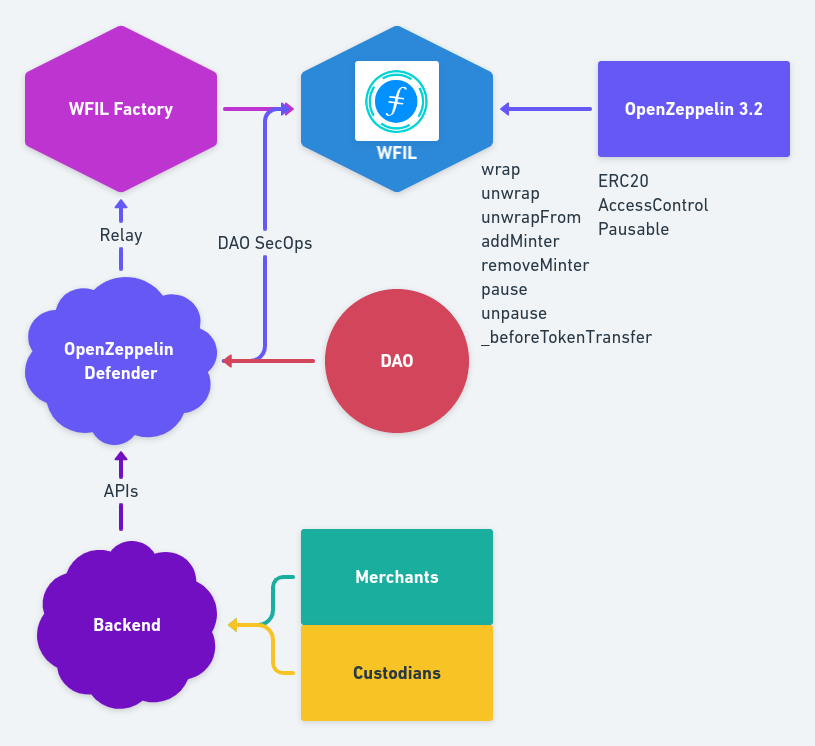

[](https://ubuntu.com/download/desktop)
[](https://github.com/nvm-sh/nvm#installation-and-update)
[](https://www.trufflesuite.com/)
[](https://github.com/ethereum/solidity/releases/tag/v0.6.12)
[](https://rinkeby.etherscan.io/address/0xf33b9e9cc559329e25ca76e338e21e8e24e14c24#code)


# WFIL

> Wrapped Filecoin, ERC20 Wrapper over Filecoin

`WFIL` is the first ERC20 wrapper over Filecoin backed by Filecoin deposits on a custodian wallet (1:1 ratio).

WFIL is implemented using OpenZeppelin ERC20 module and controlled by a Factory contract, set as minter by a DAO multisig contract (Gnosis Safe), to allow merchants and custodians to add mint/burn requests via ad-hoc APIs that interact with OpenZeppelin Defender Relay.

Merchants and Custodians are approved by DAO members via Multisignatures.

Future Developments & Features:

We plan to develop a non-custodian version where by leveraging Filecoin smart contracts we'd be able to implement a fully decentralized application.  

One of the features we're considering is to add the permit() function to WFIL to allow meta transactions by leveraging on OpenZeppelin ERC20Permit module (currently in progress) and incentivise adoption in the space.

Applications:

- Lending Platforms (MakerDAO, Compound, Aave)
- Liquidity Pools (Curve, Balancer)
- Uniswap
- De-Fi 
- Access to Filecoin Storage Deals to Ethereum Users
- ...

## Sections
* [Building Blocks](#building-blocks)
* [Setup](#setup)
* [About](#about)

## Building Blocks



### [WFIL](./contracts/WFIL.sol)

Implements an ERC20 token by leveraging on OpenZeppelin Library.  

It allows the owner of the contract, a multisig contract (Gnosis Safe) to add/remeove a Minter (Factory contract) via **addMinter**, **removeMinter** functions by leveraging on *AccessControl* module by OpenZeppelin.

The contract implements the **wrap** function to mint WFIL by passing the recepient address and the amount of Filecoin to wrap as parameters and emitting an event, *Wrapped*.  

The contract also implements the **unwrapFrom** function to allow the Factory contract to burn the WFIL by passing the holder address  and the amount of WFIL to burn as parameters and emitting an event, *Unwrapped*. In order to mitigate Allowance Double-Spend Exploit we recommend merchants to use **increaseAllowance** and **decreaseAllowance** functions.  

The contract inherits OpenZeppelin *AccessControl* module to set the Pauser role to the owner of the contract that can call the **pause**, **unpause** functions in case of emergency (Circuit Breaker Design Pattern).

Once the owner call the **pause** function, thanks to the **_beforeTokenTransfer()** hook, *_mint()*, *_burn()* and *_transfer()* internal functions, will revert.    
To avoid users from sending *WFIL* to the contract address, **_beforeTokenTransfer()** checks the recipient address to make sure it does not correspond to the contract address, and revert if it does on *_mint* and *_transfer* functions.   

A **Gnosis Safe Multisig** is set as owner during deployment (*dao_*) to allow DAO members to grant the Minter Role to the Factory contract and future versions.  

Setup
============

Clone this GitHub repository.

## Steps to compile and test

  - Local dependencies:
    - Truffle
    - Ganache CLI
    - OpenZeppelin Contracts v3.1.0
    - Truffle HD Wallet Provider
    - Truffle-Flattener
    - Truffle-Plugin-Verify
    - Solhint
    ```sh
    $ npm i
    ```
  - Global dependencies:
    - Truffle (recommended):
    ```sh
    $ npm install -g truffle
    ```
    - Ganache CLI (recommended):
    ```sh
    $ npm install -g ganache-cli
    ```
    - Slither (optional):
    ```sh
    $ git clone https://github.com/crytic/slither.git && cd slither
    $ sudo python3 setup.py install
    ```
    - MythX CLI (optional):
    ```sh
    $ git clone git://github.com/dmuhs/mythx-cli && cd mythx-cli
    $ sudo python setup.py install
    ```
## Running the project with local test network (ganache-cli)

   - Start ganache-cli with the following command (global dependency):
     ```sh
     $ ganache-cli
     ```
   - Compile the smart contract using Truffle with the following command (global dependency):
     ```sh
     $ truffle compile
     ```
   - Deploy the smart contracts using Truffle & Ganache with the following command (global dependency):
     ```sh
     $ truffle migrate
     ```
   - Test the smart contracts using Mocha & OpenZeppelin Test Environment with the following command:
     ```sh
     $ npm test
     ```
   - Analyze the smart contracts using Slither with the following command (optional):
      ```sh
      $ slither .
      ```
   - Analyze the smart contracts using MythX CLI with the following command (optional):
     ```sh
     $ mythx analyze
     ```
## Development deployment
**WFIL 0.7.0 (Rinkeby):** [0xf33b9e9cc559329e25ca76e338e21e8e24e14c24](https://rinkeby.etherscan.io/address/0xf33b9e9cc559329e25ca76e338e21e8e24e14c24#code)

About
============
## Inspiration & References


[](https://github.com/wfil/awesome-wfil/blob/master/README.md#references)

## Authors

Project created by [Nazzareno Massari](https://nazzarenomassari.com) and [Cristiam Da Silva](https://cristiamdasilva.com/).  
Logo by Cristiam Da Silva.
